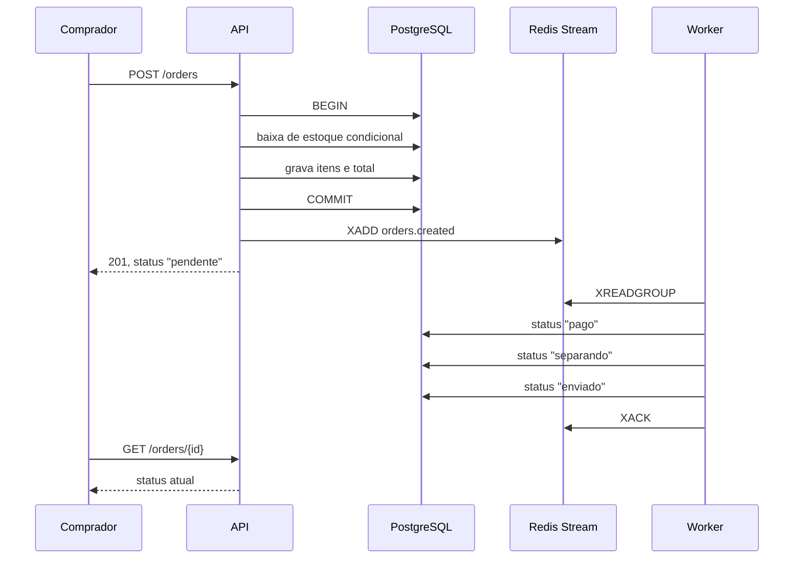

# API de e-commerce em Go

API REST de uma loja: o vendedor publica produtos, o comprador se cadastra e compra, o pedido baixa estoque dentro de uma transação e é processado depois por um worker assíncrono.

Projeto de estudo. O objetivo não foi entregar uma loja pronta para produção, e sim exercitar, num fluxo fechado e pequeno, assuntos que eu só tinha visto de forma isolada: transação, concorrência, autorização e processamento fora do ciclo da requisição.

O frontend que consome esta API é um projeto Next.js separado, em outro repositório.

---

## Stack

| | |
|---|---|
| Linguagem | Go 1.26.1 |
| Roteamento | chi v5 |
| Banco | PostgreSQL 17, acesso com pgx v5 e pool de conexões |
| Consultas | sqlc — o SQL é escrito à mão e o Go é gerado a partir dele |
| Migrations | goose v3 |
| Fila | Redis Streams (go-redis v9) |
| Autenticação | JWT em cookie httpOnly, via jwtauth v5 |
| Empacotamento | Docker multi-stage, imagens distroless |

---

## Como rodar

Sobe banco, fila, migrations, API e worker:

```bash
docker compose up -d
```

A API responde em `http://localhost:8080`.

A ordem de subida é declarada no `docker-compose.yaml` e não depende de sorte: o Postgres precisa passar no healthcheck, então o serviço `migrate` roda o goose e **termina**, e só depois a API e o worker sobem — via `depends_on` com `service_completed_successfully`. Ver o `migrate` como `Exited (0)` é o comportamento esperado, não um erro.

Para desenvolver sem reconstruir imagem a cada alteração, o `executar.bat` sobe a infraestrutura em container e a API e o worker com `go run`.

---

## Fluxo de um pedido



O comprador não recebe notificação: ele consulta o status. A atualização na tela vem de o frontend refazer a consulta em intervalos.

---

## Endpoints

**Públicos**

| Método | Rota | |
|---|---|---|
| GET | `/products` | lista com busca, filtro por categoria e faixa de preço, paginação |
| GET | `/product/{id}` | detalhe |
| GET | `/categories` | categorias cadastradas |
| GET | `/health`, `/pronto` | liveness e readiness |
| POST | `/auth/register`, `/auth/login` | devolvem o cookie de sessão |

**Autenticados**

| Método | Rota | |
|---|---|---|
| GET | `/auth/me` | usuário da sessão |
| POST | `/auth/logout` | |
| POST | `/orders` | cria o pedido |
| GET | `/orders/me` | pedidos do comprador logado |
| GET | `/orders/{id}` | um pedido, **escopado pelo dono** |

**Restritos ao papel `vendedor`**

| Método | Rota | |
|---|---|---|
| GET | `/me/products` | produtos do vendedor logado |
| POST | `/products` | cria |
| PATCH | `/products` | edita |
| DELETE | `/products?id=` | desativa |

Nenhuma rota autenticada recebe o id do usuário pela URL ou pelo corpo. Ele sai sempre da claim `sub` do token, para não existir parâmetro que o cliente possa trocar.

---

## Decisões e trade-offs

### Baixa de estoque dentro da própria escrita

Foi o problema mais instrutivo do projeto, e vale detalhar porque a primeira versão parecia correta lendo o código.

Eu tinha escrito assim: ler a quantidade, comparar com o pedido em Go, e gravar o valor já calculado.

```go
product, _ := qtx.FindProductByID(ctx, item.ProductID)   // leu 10
if product.Quantity < item.Quantity { ... }              // decidiu com o 10
qtx.UpdateStock(..., Quantity: product.Quantity - 1)     // gravou 9
```

O defeito não está em nenhuma dessas linhas isoladamente — está no intervalo entre a primeira e a terceira. Nenhum lock cobre dois comandos separados, então várias transações simultâneas leem o mesmo 10, todas concluem que há estoque, e todas gravam 9.

A versão atual não tem esse intervalo, porque a checagem e a baixa são a mesma instrução:

```sql
UPDATE products SET quantity = quantity - $1
WHERE id = $2 AND quantity >= $1
```

O cálculo passa a ser feito pelo Postgres a partir do valor corrente da linha, sob lock, e a condição de saldo vai junto no `WHERE`. Quando não há saldo, o comando afeta zero linhas — e é esse zero que o Go traduz em "sem estoque".

O `SELECT` anterior continua no código, mas só para obter o preço. Ele ainda pode ler um valor desatualizado; isso deixou de importar quando nenhuma decisão passou a depender dele.

### Autorização é comparação, não framework

Produto e pedido pertencem a alguém, e a verificação é uma comparação com a claim do token. Não há camada de permissões.

Quando o recurso existe mas é de outra pessoa, a resposta é **404, não 403**. Um 403 confirmaria que aquele id existe, o que já é informação. A escolha é consciente e tem custo: fica mais difícil distinguir "não existe" de "não é seu" ao depurar.

No caso de produto, isso é feito pelo próprio SQL — a cláusula `WHERE id = $1 AND seller_id = $2` faz o banco não devolver linha nenhuma quando o dono não confere, em vez de o Go comparar depois de ter lido.

### Exclusão é desativação

`DELETE /products` marca `active = false`. Apagar de verdade quebraria pedidos antigos que referenciam o produto, já que `order_items.product_id` tem chave estrangeira para `products`. O produto sai da vitrine e do painel do vendedor, e o histórico continua íntegro.

### Redis Streams, e não Kafka

A escolha aqui foi principalmente de custo de aprendizado e de operação. O volume é de demonstração, e o Redis Streams entrega produtor, consumer group, confirmação e fila de descarte com um container e pouca configuração. O Kafka exigiria decisões sobre partição e retenção que eu não teria como justificar com o que sei hoje.

**É importante registrar o limite:** esta é a primeira vez que eu escrevo processamento assíncrono, e o que está aqui é uma reprodução mínima para começar a entender o assunto — não um desenho que eu saiba defender em escala. O worker simula uma cobrança, atualiza o status a cada etapa, tenta de novo quando falha e, esgotadas as tentativas, marca o pedido e publica numa segunda stream. É o suficiente para ver o mecanismo funcionando, e explicitamente insuficiente como referência.

### Sem status em tempo real

Não há WebSocket. O comprador acompanha o pedido consultando. Um canal com atualização instantânea exigiria distribuição entre réplicas, autenticação no handshake e reconexão — peças que eu preferi não colocar sem entender direito. A troca é honesta: a atualização tem a latência do intervalo de consulta.

### Imagens distroless

As imagens finais não têm shell, gerenciador de pacotes nem libc — só o binário estático e o mínimo do sistema. Isso reduz bastante a superfície exposta e o tamanho (a da API fica em torno de 25 MB).

O custo é real e apareceu na prática: sem shell, não dá para escrever um healthcheck de container para a API do jeito usual, com `curl` ou `wget`. Hoje a API não tem healthcheck no compose por causa disso. A saída seria ensinar o próprio binário a se verificar.

### Preços em centavos

Inteiro em toda a stack, do banco ao JSON. Ponto flutuante para dinheiro acumula erro de arredondamento, e a formatação fica a cargo de quem exibe.

---

## Sobre os testes

Existe **um** teste automatizado neste repositório, e ele existe por um motivo específico.

Durante o desenvolvimento eu percebi que várias compras simultâneas do mesmo produto vendiam mais unidades do que havia em estoque. O defeito não aparecia em teste manual, porque uma requisição de cada vez nunca reproduz o problema. Também não apareceria em teste de unidade: com o banco substituído por um dublê, a disputa entre transações simplesmente não existe.

Então o teste sobe um PostgreSQL próprio com testcontainers, aplica as mesmas migrations do projeto, cria um produto com 10 unidades e dispara 50 compras simultâneas. Ele verifica o que eu não teria pensado em verificar antes de errar: que a quantidade que saiu do estoque bate com a quantidade vendida.

Essa verificação importa mais do que parece. A afirmação óbvia — "o estoque terminou em zero" — passava mesmo com o sistema errado, porque o estoque zerava de qualquer jeito; o que não fechava era a conta. Antes da correção: 49 unidades vendidas de um estoque de 10. Depois: exatamente 10, com as outras 40 tentativas recusadas.

```bash
go test ./internal/entidades/orders/ -race -v
```

**Sobre o que este repositório não demonstra:** eu ainda não tenho prática em escrever testes. Não há testes de handler, de autorização nem de casos de borda, e a verificação do resto do projeto foi manual, chamando os endpoints e conferindo o resultado no banco. O teste que existe cobre um problema real e específico; ele não representa uma suíte, e não quero que pareça uma.

---

## Limitações conhecidas

Nenhum dos itens abaixo é esquecimento. São coisas que eu identifiquei e decidi não resolver agora, geralmente por não ter segurança suficiente sobre o assunto.

**A publicação na fila não é atômica com a transação.** O `XADD` acontece depois do `COMMIT`. Se o processo morrer exatamente entre os dois, o pedido existe no banco e nunca chega ao worker. A solução conhecida para isso chama-se *transactional outbox*: gravar o evento numa tabela, dentro da mesma transação, e ter um processo separado publicando a partir dela. Não implementei.

**Não há chave de idempotência.** Clique duplo em "finalizar compra" gera dois pedidos. O caminho seria um cabeçalho `Idempotency-Key` com controle no servidor.

**O segredo do JWT está fixo no código.** Precisa vir de variável de ambiente antes de qualquer uso real.

**As variáveis de configuração têm nomes herdados da ferramenta de migration.** A API lê a string de conexão de `GOOSE_DBSTRING` e o endereço do Redis de `GOOSE_REDIS`. Funciona, mas o certo seria `DATABASE_URL` e `REDIS_ADDR`, com as `GOOSE_*` existindo apenas para o goose.

**A listagem de pedidos faz uma consulta de itens por pedido.** Resolve com um `IN` ou um `JOIN`; hoje está ingênuo.

**O DTO de produto não expõe a imagem.** O campo existe no banco e é preenchido no cadastro, mas não sai na resposta.

**Não há métricas.** Instrumentar contadores de requisição, latência e estado do pool seria o próximo passo natural.

**Não há orquestrador.** O projeto roda em Docker Compose, não em Kubernetes. As decisões que um orquestrador exige da aplicação estão feitas — liveness e readiness em endpoints separados, configuração por ambiente, imagem mínima, desligamento tratando `SIGTERM` — mas eu não rodei isso em cluster, e não quero afirmar experiência que não tenho.

---

## Estrutura

```
cmd/
  main.go, api.go      API HTTP
  worker/              consumidor da fila, binário separado
internal/
  entidades/           auth, products, orders — handler, service, DTO
  adapters/postgresql/ migrations e código gerado pelo sqlc
  autenticacao/        leitura das claims do token
  env/, json/          utilitários
```

A divisão por entidade, com handler, service e DTO juntos, foi escolhida para manter próximo o que muda junto. O handler cuida de HTTP, o service cuida da regra e da transação, e o DTO existe para que a forma da resposta não seja o schema da tabela — mudar uma coluna não deve quebrar o cliente.
