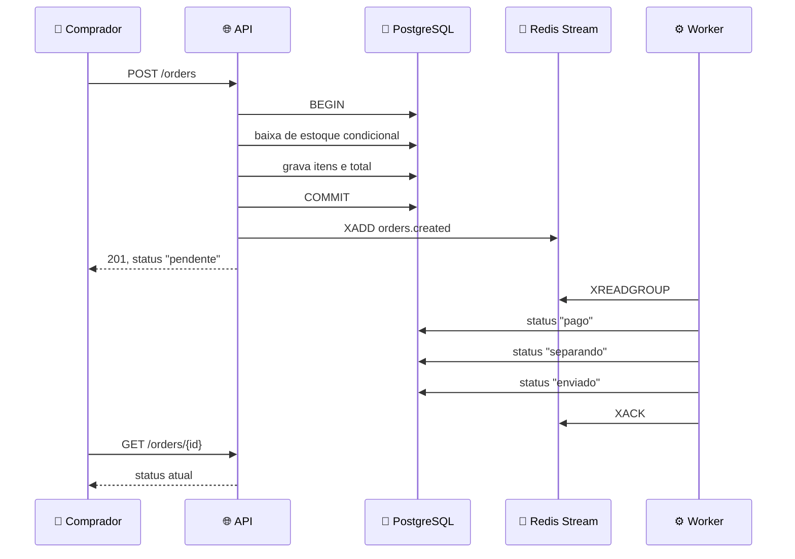

# 🛒 API de e-commerce em Go

[](https://github.com/turos22/APIRESTFull_GoLang/actions/workflows/ci.yml)


API REST de uma loja: o vendedor publica produtos, o comprador se cadastra e compra, o pedido baixa estoque dentro de uma transação e é processado depois por um worker assíncrono.

Projeto de estudo. O objetivo não foi entregar uma loja pronta para produção, e sim exercitar num fluxo fechado assuntos que eu só tinha visto isolados: transação, concorrência, autorização e processamento fora do ciclo da requisição.

O frontend que consome esta API é um projeto Next.js separado, em outro repositório.

---

## ✨ Destaques

| | | |
|---|---|---|
| 🔐 | **Senha com bcrypt** | Hash com custo 12. A senha nunca é guardada nem trafega de volta |
| 🎫 | **JWT em cookie httpOnly** | O JavaScript da página não alcança o token. Papel (`comprador` / `vendedor`) vai na claim |
| 🛡️ | **Autorização por dono** | Produto e pedido alheios respondem **404**, não 403 — um 403 já confirmaria que o id existe |
| 📦 | **Baixa de estoque atômica** | Checagem e escrita na mesma instrução SQL, sob lock de linha. Sem intervalo entre decidir e gravar |
| ⚡ | **Teste de concorrência** | 50 goroutines disputando 10 unidades |
| 🐘 | **PostgreSQL em container** | Porta, volume e healthcheck no compose. Migrations versionadas com goose |
| 🧵 | **Redis Streams + worker** | Consumer group, confirmação por `XACK`, nova tentativa e fila de descarte |
| 🐳 | **Imagens distroless** | Sem shell, sem libc, usuário não-root. A da API fica em ~25 MB |
| 🔄 | **CI no GitHub Actions** | `vet`, `build`, `test -race` e build das três imagens a cada push |
| 💰 | **Preço em centavos** | Inteiro em toda a stack, do banco ao JSON. Sem ponto flutuante para dinheiro |

---

## ⚡ O teste de concorrência

O único teste automatizado do projeto, e vale explicar por que ele existe sozinho.

Durante o desenvolvimento eu percebi que compras simultâneas do mesmo produto vendiam mais unidades do que havia em estoque. Teste manual não pegava — uma requisição por vez nunca reproduz. Teste de unidade também não pegaria: com o banco trocado por um dublê, a disputa entre transações deixa de existir.

Então o teste sobe um PostgreSQL próprio com **testcontainers**, aplica as mesmas migrations do projeto e dispara 50 compras ao mesmo tempo contra um estoque de 10.

```
antes da correção   →   49 vendidas, estoque caindo só 10
depois              →   10 vendidas, 40 recusadas
```

O que ele verifica não é o óbvio. "O estoque terminou em zero" passava **mesmo com o sistema errado**, porque zerava de qualquer jeito — o que não fechava era a conta entre o que saiu do estoque e o que foi vendido.

```bash
go test ./internal/entidades/orders/ -race -v
```

> O Docker precisa estar rodando: é o testcontainers que sobe o banco. Com ele parado, o erro fala em *"rootless Docker is not supported on Windows"*, o que engana — o problema é o daemon fora do ar.

**É um teste amador, escrito para eu aprender o assunto.** Não representa uma suíte: não há teste de handler, de autorização nem de casos de borda, e a verificação do resto do projeto foi manual.

---

## 🚀 Como rodar

```bash
docker compose up -d
```

Sobe banco, fila, migrations, API e worker. A API responde em `http://localhost:8080`.

A ordem não depende de sorte: o Postgres precisa passar no healthcheck, o serviço `migrate` roda o goose e **termina**, e só então a API e o worker sobem. Ver `migrate` como `Exited (0)` é o esperado, não erro.

Para desenvolver sem reconstruir imagem a cada alteração, o `executar.bat` sobe a infraestrutura em container e a API e o worker com `go run`.

---

## 🔀 Fluxo de um pedido



O comprador não recebe notificação — ele consulta. A atualização na tela vem do frontend refazendo a consulta em intervalos.

---

## 📡 Endpoints

**🌍 Públicos**

| | Rota | |
|---|---|---|
| `GET` | `/products` | busca, filtro por categoria e faixa de preço, paginação |
| `GET` | `/product/{id}` | detalhe |
| `GET` | `/categories` | categorias cadastradas |
| `GET` | `/health` · `/pronto` | liveness e readiness |
| `POST` | `/auth/register` · `/auth/login` | devolvem o cookie de sessão |

**🔒 Autenticados**

| | Rota | |
|---|---|---|
| `GET` | `/auth/me` | usuário da sessão |
| `POST` | `/auth/logout` | |
| `POST` | `/orders` | cria o pedido |
| `GET` | `/orders/me` | pedidos do comprador logado |
| `GET` | `/orders/{id}` | um pedido, escopado pelo dono |

**🏪 Restritos ao papel `vendedor`**

| | Rota | |
|---|---|---|
| `GET` | `/me/products` | produtos do vendedor logado |
| `POST` | `/products` | cria |
| `PATCH` | `/products` | edita |
| `DELETE` | `/products?id=` | desativa |

Nenhuma rota autenticada recebe o id do usuário pela URL ou pelo corpo. Ele sai sempre da claim `sub` do token, para não existir parâmetro que o cliente possa trocar.

---

## 🧭 Decisões, em uma linha cada

- **Exclusão é desativação** — `active = false`, porque `order_items` referencia o produto e apagar quebraria pedido antigo.
- **Redis Streams, não Kafka** — o volume é de demonstração; Streams dá produtor, consumer group, ack e descarte com um container.
- **Sem WebSocket** — o status vai por consulta. Push exigiria hub, autenticação no handshake e reconexão.
- **Distroless** — menos superfície exposta, ao custo de não ter shell para healthcheck de container.
- **sqlc** — o SQL é escrito à mão e o Go é gerado a partir dele, então o banco não vira abstração.

> Sobre a fila: é a primeira vez que escrevo processamento assíncrono. O que está aqui é uma reprodução mínima para começar a entender o assunto, não um desenho que eu saiba defender em escala.

---

## 📁 Estrutura

```
cmd/
  main.go, api.go      API HTTP
  worker/              consumidor da fila, binário separado
internal/
  entidades/           auth, products, orders — handler, service, DTO
  adapters/postgresql/ migrations e código gerado pelo sqlc
  autenticacao/        leitura das claims do token
  env/, json/          utilitários
```

Divisão por entidade, com handler, service e DTO juntos, para manter próximo o que muda junto. O handler cuida de HTTP, o service cuida da regra e da transação, e o DTO existe para a forma da resposta não ser o schema da tabela.
